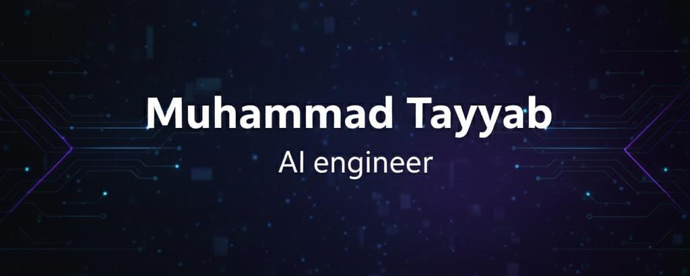

<!-- Improved README.md -->

   
  <!-- Assuming 1.png is a suitable banner, if not I'll just use text or the existing file -->
  
  <h1>Hi there, I'm Tayyab! </h1>
  
  <h3>🚀 CTO @ <a href="#">Fitro</a> | 🧠 AI Engineer | 💻 Full Stack Developer</h3>

  

    Building the future of fitness with AI. Passionate about creating scalable web applications and intelligent systems.
  

  

    
  

  

    
    
    
  

## 🔭 Current Focus: **Fitro**
> **Fitro** is an AI-powered fitness application revolutionizing how people approach their health journey. 

- **Role**: CTO
- **Mission**: To integrate cutting-edge AI for personalized workout plans and real-time form correction.
- **Status**: 🚀 Startup Implementation Phase

---

## 🏆 Achievements

- **🏆 Winner – NASA Space Apps Challenge Hyderabad (2025)**  
  Built a web-based solution using Next.js, Three.js, ML, and Flask. Nominated for Global Round 2025.

- **🥇 Winner – Hacktoberfest by AWS MUET (2024) & 🥈 Runner-up (2025)**  
  Developed a cross-platform mobile app using Expo React Native.

- **🏅 Technofest 2026 ML Mastery Challenge Winner**

---

## 💼 Work Experience

### **Web Development Intern** @ MUET FM 92.6
> Developed and deployed a full-stack website for MUET FM.

- 👨‍💻 Handled both **frontend** and **backend** development (UI design, DB integration, Auth).
- 🚀 Optimized performance and ensured smooth deployment with live testing and real-time updates.

---

## 🛠️ Tech Stack

### **Languages**

### **Frontend**

### **Backend**

### **AI & Machine Learning**

### **Tools & DevOps**

---

## 📈 GitHub Stats

  
  

 

 
  <!-- using demolab for better reliability -->
  

 

  

---

  <h3>🤝 Connect with me</h3>
  
Let's collaborate on AI, Web3, or Fitness Tech projects!

